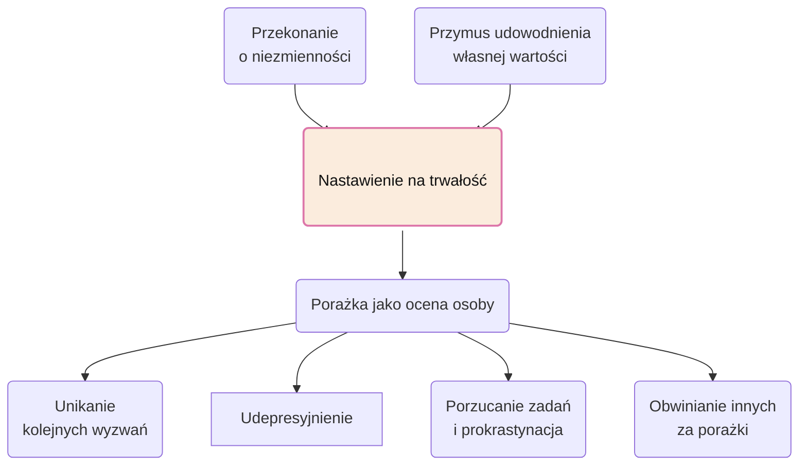

# Nastawienie na rozwój lub trwałość

- Czy przejawiamy różne nastawienie w różnych sytuacjach życiowych?
	- Tak. Można też zmieniać swoje nastawienie.
- Czy edukacja mogłaby wspierać nastawienie rozwojowe w ten sposób, że oceny cząstkowe nie wpływają na ocenę końcową w sposób bezpośredni, a jednocześnie uchronić proces przed faworyzacja?

## Historia genialnej skrzypaczki, która się ogarnęła

> [!quote]
> Salerno-Sonnenberg nie chciała stracić nauki u DeLay. W końcu zdecydowała zatem, że nawet uczciwa porażka będzie lepsza niż droga, którą dotąd kroczyła, i zaczęła się przygotowywać pod okiem nauczycielki do nadchodzącego konkursu. Po raz pierwszy w życiu dała z siebie wszystko – i wygrała. Teraz mówi: „To akurat wiem na pewno – o to, co kochasz najbardziej, musisz najzażarciej walczyć. A kiedy to muzykę kochasz, czeka cię walka życia”.

> [!question]
> Czy zadziała się faktyczna zmiana nastawienia, czy jednak tak ciężko pracowała bojąc się porażki i dzięki temu, że była uzdolniona, udało jej się wygrać. 

> [!answer]
> Generalnie ludzie z nastawieniem na trwałość wolą odnosić sukcesy bez wysiłku, bo to najlepszy sposób na udowodnienie swego talentu. Przyznaję jednak, że wśród ludzi sukcesu jest też wielu takich, którzy uważają swoje cechy za niezmienne i ciągle szukają potwierdzenia swojej wartości.
> ...
> Ludzie ci mogą być wolni od przekonania, że ciężka praca dowodzi braku umiejętności, mają jednak inne cechy typowe dla nastawienia na trwałość. Możliwe, że muszą nieustannie demonstrować swój talent. Zapewne czują, że dzięki swoim uzdolnieniom są lepsi od innych. Bardzo prawdopodobne, że nie tolerują błędów, krytyki, i niepowodzeń –wszystkiego, co może im utrudnić dotarcie do celu.

## Model nastawienia na trwałość 

[[Dysocjacja to adaptacja]]
[[Plusy rozwoju, minusy trwałości - ćwiczenie]]
[[Caroline Dweck - Nowa psychologia sukcesu]]
[[Umiejscowienie kontroli]]
