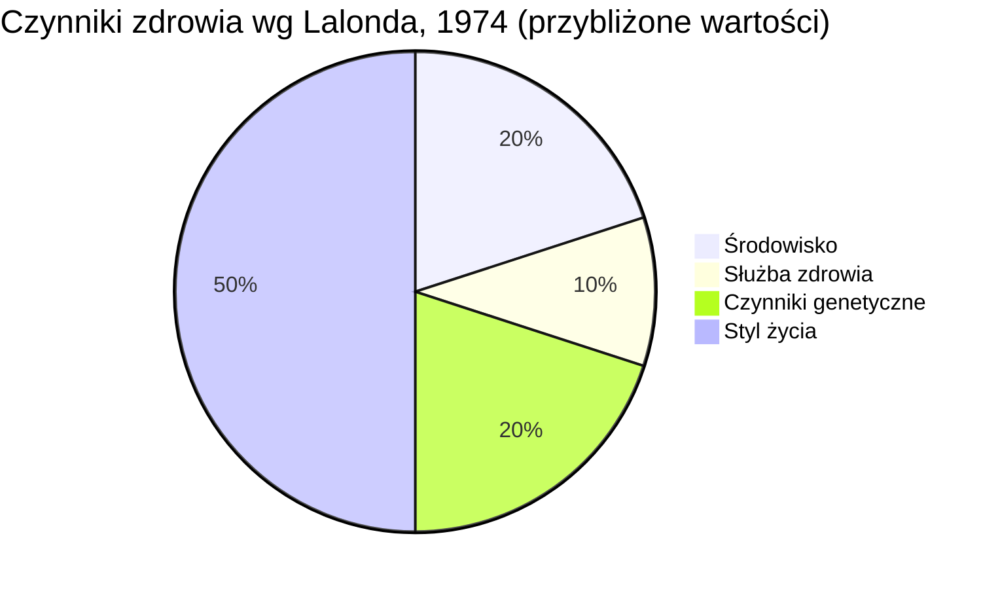

# Pola zdrowia Lalonda

Więcej na ten temat w Psychologia zdrowia, Heszen, R. 1

```mermaid
pie title Czynniki zdrowia wg Lalonda, 1974 (przybliżone wartości)
    "Środowisko" : 20
    "Służba zdrowia" : 10
    "Czynniki genetyczne" : 20
    "Styl życia": 50

```

^868c46
